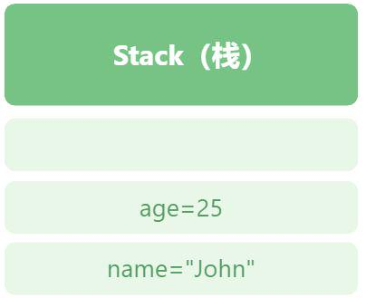
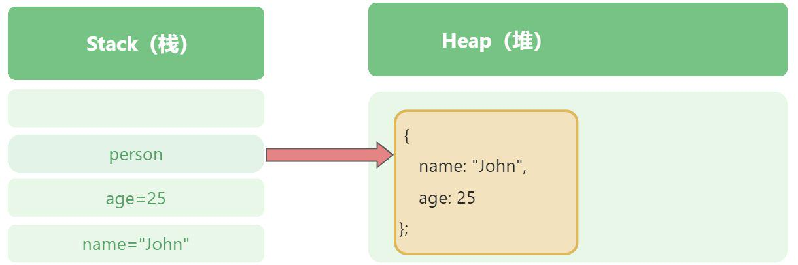
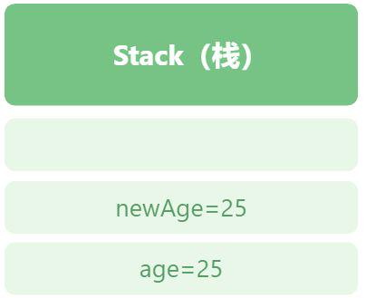
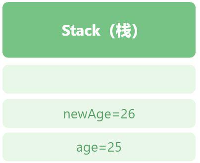

# 原始数据类型和引用数据类型的区别？

JavaScript 包含两种不同类型的值：

-   原始数据类型（Primitive values）
-   引用数据类型（Reference values）

栈内存和堆内存 当定义一个变量的时候，JavaScript 引擎会为变量分配两种内存：栈内存和堆内存。

静态值在编译阶段有固定的大小，静态值有：

原始值：`Null`、`Undefined`、`Boolean`、`Number`、`String`、`Symbol`、`BigInt` 引用值：是对象的引用。 静态值有固定的大小，不能改变。JavaScript 引擎为它们分配一片固定的内存，并存储在栈上。例如：

```js
let name = "John";
let age = 25;
```

因为 `name` 和 `age` 都是原始值类型，JavaScript 引擎将它们存储在栈上，如下图所示：



JavaScript 将对象（Object) 存储在堆（heap）上。

```js
let person = {
  name: "John",
  age: 25
};
```

内存如下图：



JavaScript 引擎在堆内存上创建了一个新的对象，同时它和栈内存上的 `person` 变量连接。因此，我们说 `person` 变量是对象的引用。

# 动态属性

一个引用值允许我们添加、修改和删除属性，例如：

```js
let person = {
    name: "John",
    age: 25
};

// 添加属性 ssn 
person.ssn = "123-45";

// 修改 name
person.name = "John Doe";

// 删除属性 age 
delete person.age;

console.log(person); // {name: 'John Doe', ssn: '123-45'}
```

# 复制值

## 原始值

**对于原始值来说，JavaScript 引擎创建一个值的副本，并将值赋给新的变量。**

```js
let age = 25;
let newAge = age; 
console.log(age, newAge); // 25 25
```

过程如下：

首先，声明一个变量 age，并将 25 赋值给它。 其次，声明另一个新的变量 newAge，将 age 赋值给 newAge，JavaScript 引擎将 25 复制了一份，给了新变量。

如下图：



因此，对两个变量的操作不会互相影响。

```js
let age = 25;
let newAge = age;

newAge = newAge + 1;
console.log(age, newAge); // 25 26
```

如下图：



引用值 对于引用值来说，复制的值指向的是同一个对象，因此操作的是也是同一个对象。

当我们将一个引用值从一个变量赋值给另一个变量，JavaScript 引擎创建一个引用（深拷贝除外），因此两个变量都是指向堆内存中的同一个对象。意味着，你修改其中一个，另一个也会被修改。

```js
let person = {
    name: "John",
    age: 25
}

let member = person;
member.age = 26;

console.log(person); // {name: 'John', age: 26}
console.log(member); // {name: 'John', age: 26}

// 深拷贝
let person = {
  name: "John",
  age: 25,
};

//   let member = person; // 浅拷贝
//   let member = structuredClone(person); // 深拷贝
let member = {...person}; // 深拷贝
member.age = 26;

console.log(person); // {name: 'John', age: 25}
console.log(member); // {name: 'John', age: 26}
```

## 总结

-   JavaScript 有两种类型的值：`原始值`和`引用值` 引用类型的值可以对它的属性做增删改查，原始值不行
-   从一个变量复制原始值到另一个变量，会创建一个独立的值的备份，意味着修改一个变量不会影响到另一个变量
-   从一个变量复制引用值到另一个变量，两个变量会指向同一个对象，意味着通过一个变量修改对象将会影响到另一个对象。
-   深拷贝引用的是原始值等于开辟了新的栈内存
