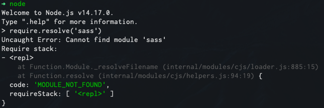

# sass-loader 突然不认 /deep/ 语法了

## 问题描述

一个老项目需要维护，`clone` 代码以后 `yarn` 安装依赖，当运行的时候，突然报错：
```
ERROR in ./src/style/common.scss
Module build failed (from ./node modules/_mini-css-extract-plugin@0.9.0@mini-css-extract-plugin/sass-loader/dist/cjs.js):
ModuleBuildError: Module build failed(from .node_modules/_sass-loader@8.0.2@sass-loader/dist/cjs.js)
SassError: expected selector.
/deep/::.unit-wrap{
^
```

## 问题排查

刚开始以为是 sass-loader 版本高了，开始降低版本，结果不起作用；
降低 node 版本，结果不起作用；
## 最终解决
    后来发现node 会先从全局加载 sass-loader，这玩意本身不识别 `/deep/` 语法；
    所以只要在控制台运行 node 
随后输入 `require.resolve('sass') ` 如果打印出路径来了，那么就是他影响的删掉就好了；
这样是正常的：




