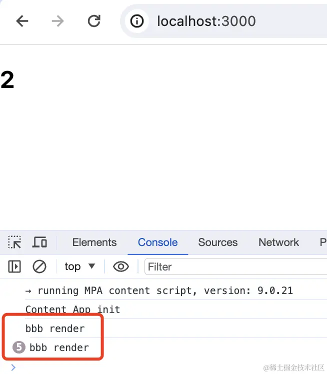
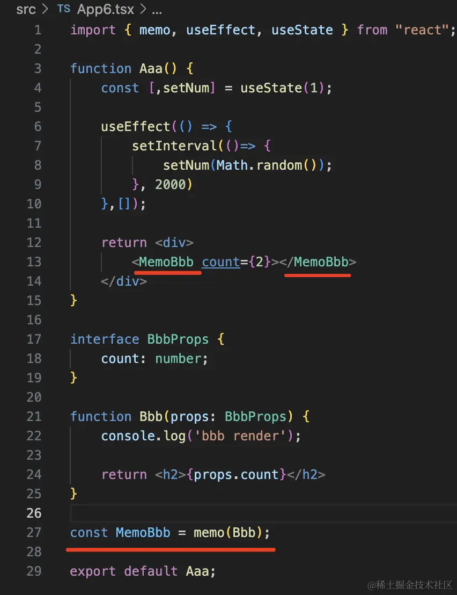
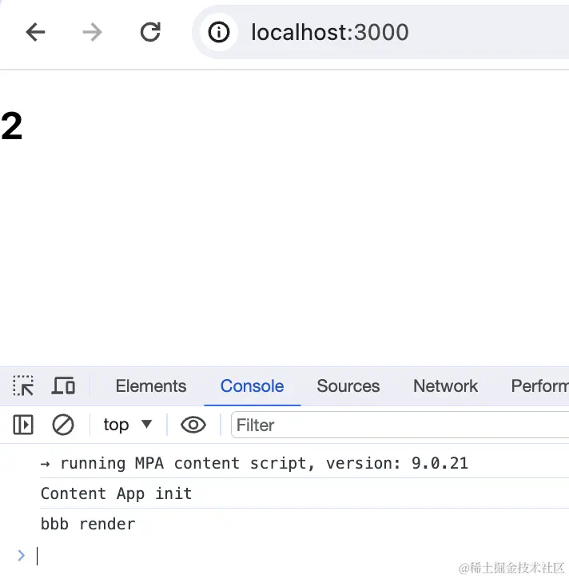
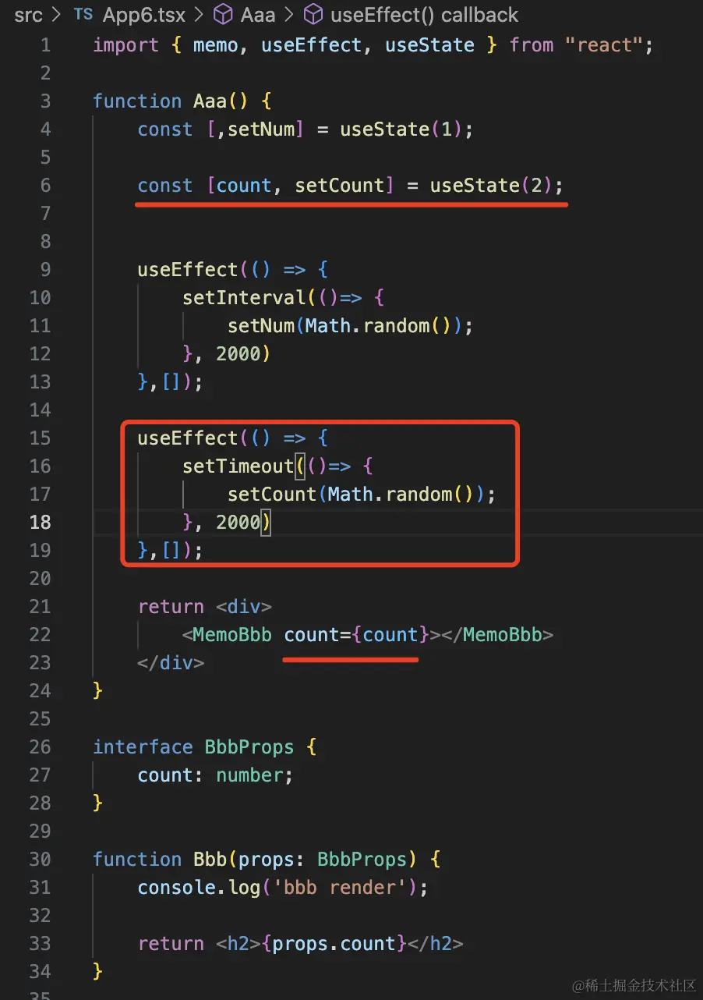
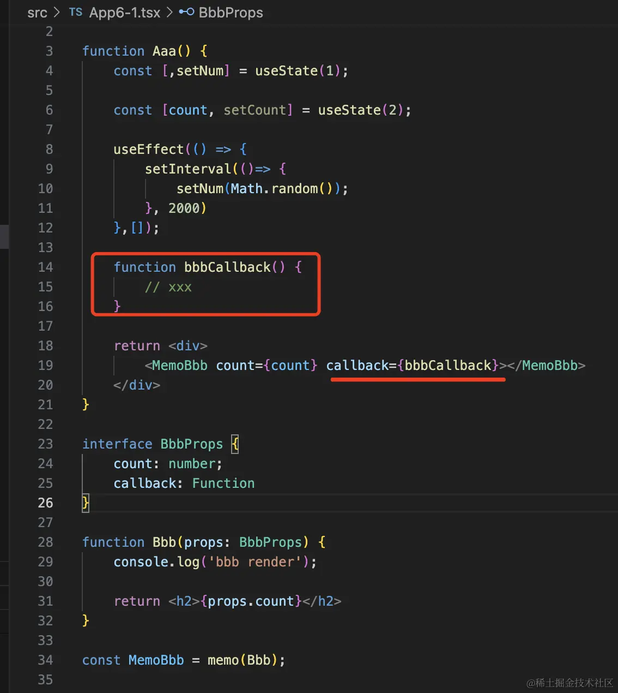
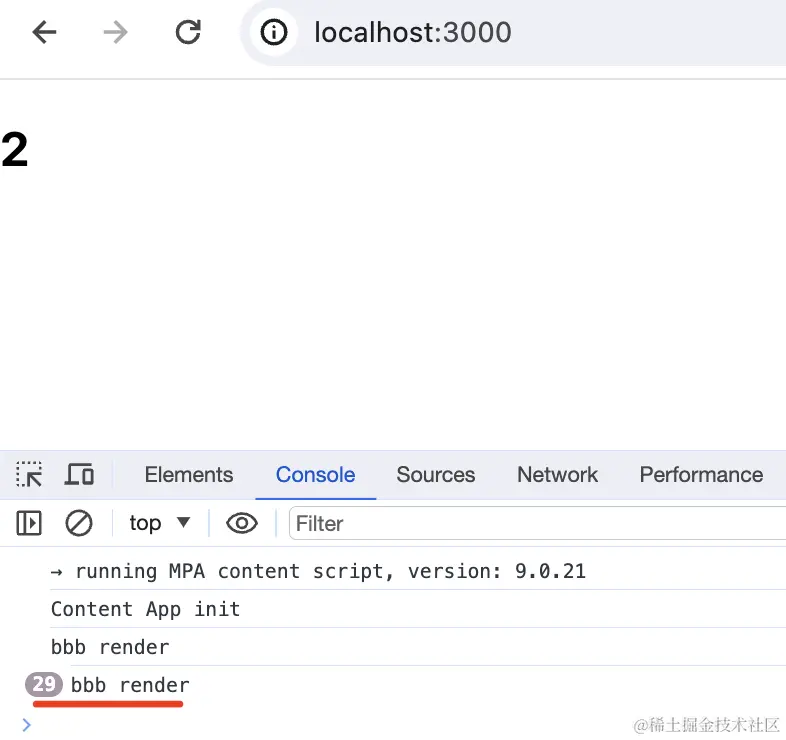

# memo + useMemo + useCallback

有两个组件 Aaa、Bbb，Aaa 是 Bbb 的父组件：

```react&#x20;tsx
import { memo, useEffect, useState } from "react";

function Aaa() {
    const [,setNum] = useState(1);

    useEffect(() => {
        setInterval(()=> {
            setNum(Math.random());
        }, 2000)
    },[]);

    return <div>
        <Bbb count={2}></Bbb>
    </div>
} 

interface BbbProps {
    count: number;
}

function Bbb(props: BbbProps) {
    console.log('bbb render');

    return <h2>{props.count}</h2>
}

export default Aaa;

```

在 Aaa 里面不断 setState 触发重新渲染，问：

bbb render 打印几次？



答案是每 2s 都会打印。

也就是说，每次都会触发 Bbb 组件的重新渲染。

但很明显，这里 Bbb 并不需要再次渲染。

这时可以加上 memo：



```react&#x20;tsx
import { memo, useEffect, useState } from "react";

function Aaa() {
    const [,setNum] = useState(1);

    useEffect(() => {
        setInterval(()=> {
            setNum(Math.random());
        }, 2000)
    },[]);

    return <div>
        <MemoBbb count={2}></MemoBbb>
    </div>
} 

interface BbbProps {
    count: number;
}

function Bbb(props: BbbProps) {
    console.log('bbb render');

    return <h2>{props.count}</h2>
}

const MemoBbb = memo(Bbb);

export default Aaa;

```

memo 的作用是只有 props 变的时候，才会重新渲染被包裹的组件。

这样就只会打印一次了：



我们让 2s 后 props 变了呢？



```react&#x20;tsx
import { memo, useEffect, useState } from "react";

function Aaa() {
    const [,setNum] = useState(1);

    const [count, setCount] = useState(2);


    useEffect(() => {
        setInterval(()=> {
            setNum(Math.random());
        }, 2000)
    },[]);

    useEffect(() => {
        setTimeout(()=> {
            setCount(Math.random());
        }, 2000)
    },[]);

    return <div>
        <MemoBbb count={count}></MemoBbb>
    </div>
} 

interface BbbProps {
    count: number;
}

function Bbb(props: BbbProps) {
    console.log('bbb render');

    return <h2>{props.count}</h2>
}

const MemoBbb = memo(Bbb);

export default Aaa;

```

props 变了会触发 memo 的重新渲染：


用 memo 的话，一般还会结合两个 hook：useMemo 和 useCallback。

**memo 是防止 props 没变时的重新渲染，useMemo 和 useCallback 是防止 props 的不必要变化。**

给 Bbb 加一个 callback 的参数：



参数传了一个 function，你会发现 memo 失效了：



因为每次 function 都是新创建的，也就是每次 props 都会变，这样 memo 就没用了。

这时候就需要 useCallback：


```react&#x20;tsx
const bbbCallback = useCallback(function () {
    // xxx
}, []);

```

它的作用就是当 deps 数组不变的时候，始终返回同一个 function，当 deps 变的时候，才把 function 改为新传入的。

这时候你会发现，memo 又生效了：


同理，useMemo 也是和 memo 打配合的，只不过它保存的不是函数，而是值：


```react&#x20;tsx
const count2 = useMemo(() => {
    return count * 10;
}, [count]);

```

它是在 deps 数组变化的时候，计算新的值返回。

所以说，**如果子组件用了 memo，那给它传递的 props 就需要用 useMemo、useCallback 包裹，否则，每次 props 都会变，memo 就没用了。**

**反之，如果 props 使用 useMemo、useCallback，但是子组件没有被 memo 包裹，那也没意义，因为不管 props 变没变都会重新渲染，只是做了无用功。**

memo + useCallback、useMemo 是搭配着来的，少了任何一方，都会使优化失效。

**但 useMemo 和 useCallback 也不只是配合 memo 用的：**

比如有个值的计算，需要很大的计算量，你不想每次都算，这时候也可以用 useMemo 来缓存。
