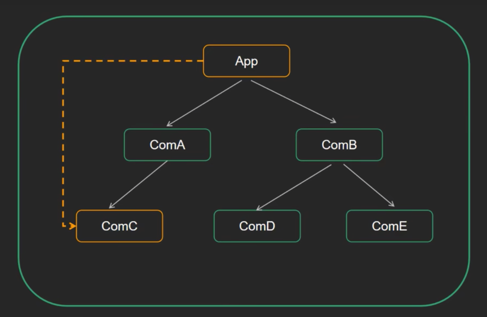

# useContext

## 目录

- [实现步骤](#实现步骤)
- [代码实现](#代码实现)



### 实现步骤

1. 使用 createContext 创建Context对象
2. 在顶层组件通过 Provider 提供数据
3. 在底层组件通过 useContext 函数获取数据

### 代码实现

```react&#x20;jsx
import React, { createContext, useContext, useState } from "react";

const Context = createContext();

function TryUseContext(props) {
  const [count, setcount] = useState(0);
  return (
    <Context.Provider value={count}>
      <div>
        <ComA />
        <button
          onClick={() => {
            setcount(count + 1);
          }}
        >
          xiugai
        </button>
        
      </div>
    </Context.Provider>
  );
}

function ComA() {
  const count = useContext(Context);
  return (
    <div>
      This is ComA---{count}
      <ComB />
    </div>
  );
}
function ComB() {
  return (
    <div>
      This is ComB
      <ComC />
    </div>
  );
}
function ComC() {
  const count = useContext(Context);
  return <div>This is ComC==={count}</div>;
}

export default TryUseContext;

```
