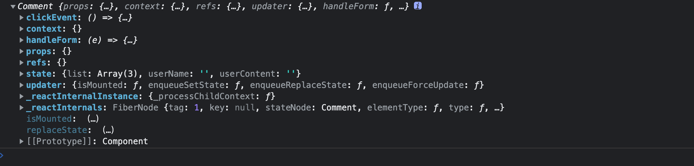

# useRef

在函数组件中获取真实的dom元素对象或者是组件对象

获取DOM

```react&#x20;jsx
import { useEffect, useRef } from react' function App(){

const h1Ref = useRef (null)

useEffect(() => {

console.log (h1Ref）

}, [])

return (

<div>

<h1 ref={ hiRef }>this is h1</h1>

</div>

export default App
```

获取组件对象

子组件

```react&#x20;jsx
import { Component } from "react";

export class Comment extends Component {
  constructor() {
    super();
    this.state = {
      list: [
        { id: 1, name: "jsc", content: "沙发" },
        { id: 2, name: "jsc1", content: "沙发1" },
        { id: 3, name: "jsc2", content: "沙发2" },
      ],
      userName: "",
      userContent: "",
    };
  }
  renderList() {
    return this.state.list.length === 0 ? (
      <div className="no-comment">暂无评论快去添加吧</div>
    ) : (
      <ul>
        {this.state.list.map((item) => (
          <li key={item.id}>
            <h3>评论人：{item.name}</h3>
            <p>评论内容：{item.content}</p>
          </li>
        ))}
      </ul>
    );
  }
  handleForm = (e) => {
    const { name, value } = e.target;
    this.setState({
      [name]: value,
    });
  };
  clickEvent = () => {
    const { userName, userContent, list } = this.state;
    if (userName.trim() === "" || userContent.trim() === "") {
      alert("请输入评论人或内容");
    } else {
      const newList = [
        {
          id: Math.random(),
          name: userName,
          content: userContent,
        },
        ...list,
      ];
      this.setState({
        list: newList,
        userName: "",
        userContent: "",
      });
    }
  };

  render() {
    const { userName, userContent } = this.state;
    return (
      <>
        <div>
          <div>
            <input
              className="user"
              type="text"
              placeholder="请输入评论人"
              value={userName}
              name="userName"
              onChange={this.handleForm}
            />
            <br />
          </div>
          <textarea
            className="content"
            cols="30"
            rows="10"
            placeholder="请输入评论内容"
            value={userContent}
            name="userContent"
            onChange={this.handleForm}
          ></textarea>
          <br />
          <button onClick={this.clickEvent}>发表评论</button>
        </div>
        {this.renderList()}
      </>
    );
  }
}

```

父组件

```react&#x20;jsx
import React, { useEffect, useRef } from "react";
import { Comment } from "../components/Comment.jsx";

function TryUseRef(props) {
  const h1ref = useRef(null);
  const comment = useRef(null);
  useEffect(() => {
    console.log(h1ref.current);
    console.log(comment.current);
  }, []);
  return (
    <div>
      <h1 ref={h1ref}>this is h1</h1>
      <Comment ref={comment}></Comment>
    </div>
  );
}

export default TryUseRef;

```

获取的结果


