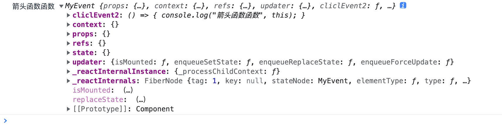
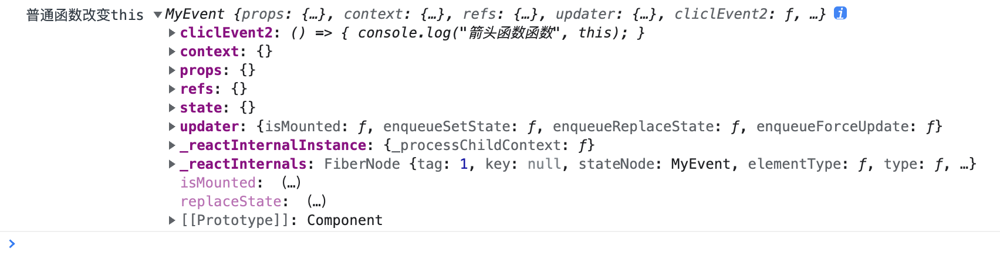
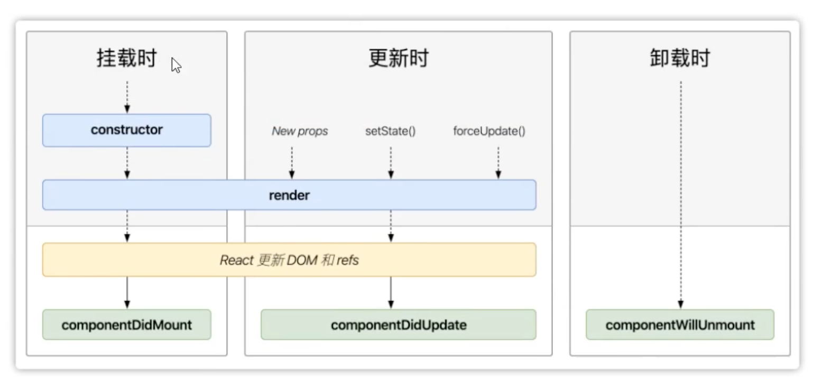

# Props语法

## 目录

- [1.1 props](#11-props)
- [1.2 props(只读属性)](#12-props只读属性)
- [2（重点）React JSX语法](#2重点React-JSX语法)
  - [主要内容](#主要内容)
  - [2.1 React State（状态）](#21-React-State状态)
    - [两种定义数据的方式](#两种定义数据的方式)
    - [2.2 React State（状态修改）](#22-React-State状态修改)
    - [2.3.1事件处理](#231事件处理)
    - [2.3.1.1事件绑定方式](#2311事件绑定方式)
    - [2.3.1.2 事件中this指向当前组件的方式](#2312-事件中this指向当前组件的方式)
    - [2.4 生命周期](#24-生命周期)
    - [2.4.1生命周期函数](#241生命周期函数)
    - [2.5 组件状态提升（组件通讯）](#25-组件状态提升组件通讯)
    - [2.6 受控组件](#26-受控组件)
    - [2.7 非受控组件](#27-非受控组件)

## 1.1 props

当 React 元素为用户自定义组件时，它会将 JSX 所接收的属性(attributes）转换为单个对象传递给组件， 这个对象被称之为 **"props"**。

```react&#x20;jsx
//class类组件
//父组件中：调用子组件时通过属性形式传递

<Head msg={“父组件传递的数据“} id='123'>


//子组件中：通过props接受

class Head extends React.Component{
rende(){
    return(
          <div>{this.props.msg}</div> 
          )
         }
        }

```

```react&#x20;jsx
//函数组件

//父组件
import Footer from "./components/Footer.jsx";
  <Footer name={"shoye"} />
  
  //子组件
  import React from "react";

function Footer(props) {
  return <div>footer{props.name}</div>;
}
export default Footer;


```

## 1.2 props(只读属性)

只能从父组件向子组件传值且不可更改父组件的数据

# 2（重点）React JSX语法

#### 主要内容

- React State（状态）
- React 事件处理
- React 组件生命周期
- 状态提升

## 2.1 React State（状态）

### 两种定义数据的方式

***

**第一种：constructor里定义数据**

特点：

1、只能在组件内使用；

2、数据是响应式的；

3、使用的时候是用 this.setSate.XXX &#x20;

```react&#x20;jsx
constructor(){
super();
this.state={
  xx:xxx,
  }
}

num=10;

//简写
this.state={
  xx:xxx,
  }

```

**第二种：直接定义数据**

特点：

1、只能在组件内使用；

2、数据是响应式的；

3、使用的时候是用 this.XXX

***

响应式：数据变了视图跟着变；MVVM

区别：

定义在constructor中的数据，通过指定的方法修改state数据同步更新视图

### 2.2 React State（状态修改）

```react&#x20;jsx
//通过对象方式来修改state对象里面的数值
this.setState({
  msg:'234'
})
```

**注意：**

更新可能是异步的当在事件环中使用this。setState对象语法就是同步。

出于性能考虑，React 可能会把多个 setState()调用合并成一个调用，并且取最后一次遇到宏任务和微任务时，就变成同步的了。

**宏任务：setTimeout setinterval**

**微任务：Promise**

***

```react&#x20;jsx
//通过函数方式来修改state，都是同步的
this.setState((state,props)=>{
  return{
      XXX:state.XXX
  }
})
```

### 2.3.1事件处理

### 2.3.1.1事件绑定方式

1. 在标签绑定，使用的属性方式
2. 事件是以”on+ 事件名称”组成，使用驼峰命名法
3. 事件的功能一般定义在外部，事件这里写 this。事件函数名称
4. 标签里不能加（），表示调用

```react&#x20;jsx
<button onClick={this.handle}></button>
```

### 2.3.1.2 事件中this指向当前组件的方式

事件三要素

事件源、 事件类型、 事件处理程序

```react&#x20;jsx

export class MyEvent extends Component {
  constructor() {
    super();
    this.state = {};
  }
  // 普通函数没有this指向
  cliclEvent() {
    console.log("普通函数", this);
  }
  // 箭头函数有this指向，并且指向组件实例
  cliclEvent2 = () => {
    console.log("箭头函数函数", this);
  };
  // 普通组件可以通过bind绑定this
  cliclEvent3() {
    console.log("普通函数改变this", this);
  }
  render() {
    return (
      <>
        <h1>myevent</h1>
        <button onClick={this.cliclEvent}>普通函数</button>
        <button onClick={this.cliclEvent2}>箭头函数函数</button>
        <button onClick={this.cliclEvent3.bind(this)}>普通函数改变this</button>
      </>
    );
  }
}
```

普通函数打印结果：


箭头函数打印结果：



普通函数this绑定后结果：



### 2.4 生命周期

### 2.4.1生命周期函数

生命周期函数（7个，废掉了3个还剩4个）

componentwil/Mount：组件将要被渲染，还没渲染，没东西（17废掉，但可以使用）

componentDidMount：组件渲染完成(组件进入运行状态)【重点：网络请求，绑定事件】&#x20;

shouldcomponentUpdate：是否允许组件更新(这个函数中必须有返回值，如果返回true，表示允许更新；如果返回false，表示不允许更新）

componentwillUpdate：组件将要开始更新（17废掉，但可以使用）

componentDidUpdate：组件更新完成（重新进入运行状态）

componentWillReceiveProps：组件接收props更新

componentwillUnMount： 组件将要卸载，还可以访问this this。setState0)只执行一次【重点：收尾工作，清空定时器】



### 2.5 组件状态提升（组件通讯）

子组件向父组件传递数据

实现方式：通过事件来实现

1. 事件定义在父组件中，通过props传递给子组件（篮子）

```react&#x20;jsx
<Son msg={this.state.msg} getSonData={this.getSonData}/>
```

1. 在子组件中执行父组件的函数

```react&#x20;jsx
/*
*发送数据给父组件
*/
sendParent=()=>{
//调用父组件提供的方法
this.props.getSonData(this.state.msg)；
}
```

1. 在子组件中调用父组件函数时把子组件中的数据作为实参传递给父组件
2. 父组件中接收数据

```react&#x20;jsx
/*
*获取儿子的数据
*/

getSonData=(data)=>{ 
  console.log (data);
  this.setState({
  sonData:data
  })
}
```

### 2.6 受控组件

介绍：在HTML 中，表单元素通常自己维护 value值，并根据用户输入进行更新。而在 React 中，可变状态 (mutable state)通常保存在组件的 state 属性中，并且只能通过使用 setState(来更新，使 React 的 state 成为“唯一数据源“。

即状态受React管控的组件

1. value：读取数据
2. onChange：设置数据

```react&#x20;jsx
<input type="text" value={this.state.value] onChange={this.handlechange} /> 
handlechange (event) {

this.setstate(fvalue: event.target.value});

```

常见的受控组件

```react&#x20;jsx
input
textarea 
select
```

### 2.7 非受控组件

在大多数情况下，我们推荐使用受控组件来处理表单数据。在一个受控组件中，表单数据是由 React 组件来管理的。另一种替代方案是使用非受控组件，这时表单数据将交由 DOM 节点来处理，可以使用 ref 来从 DOM 节点中获取表单数据。

1.功能：

1. 获取Dom元素
2. 获取子组件实例

**创建步骤：**

在构造函数里创建Ref语法：this.myRef = React.createRe()

绑定到元素上：`＜E ref={this.myRef}></E>`

获DOM元素：`this.myRef.current`
