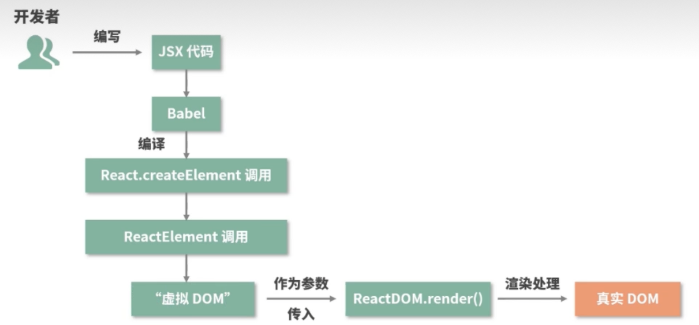
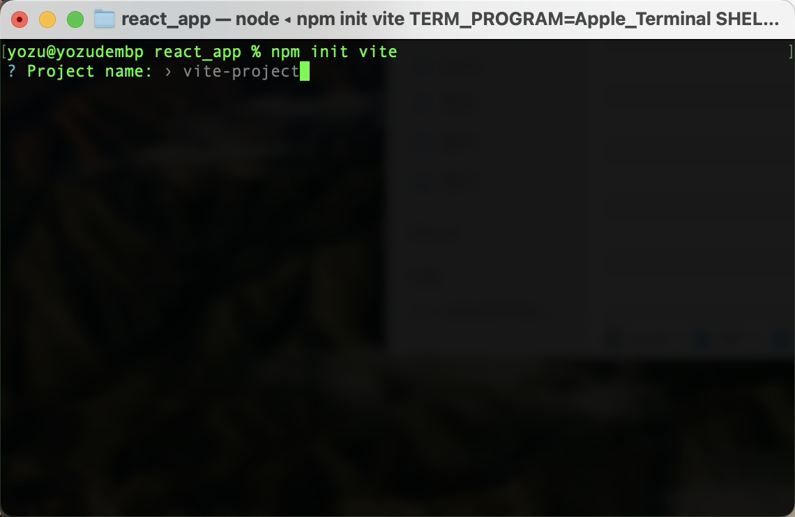
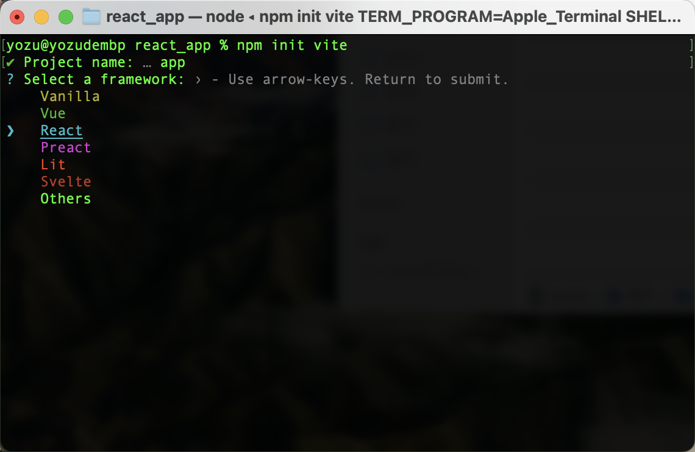
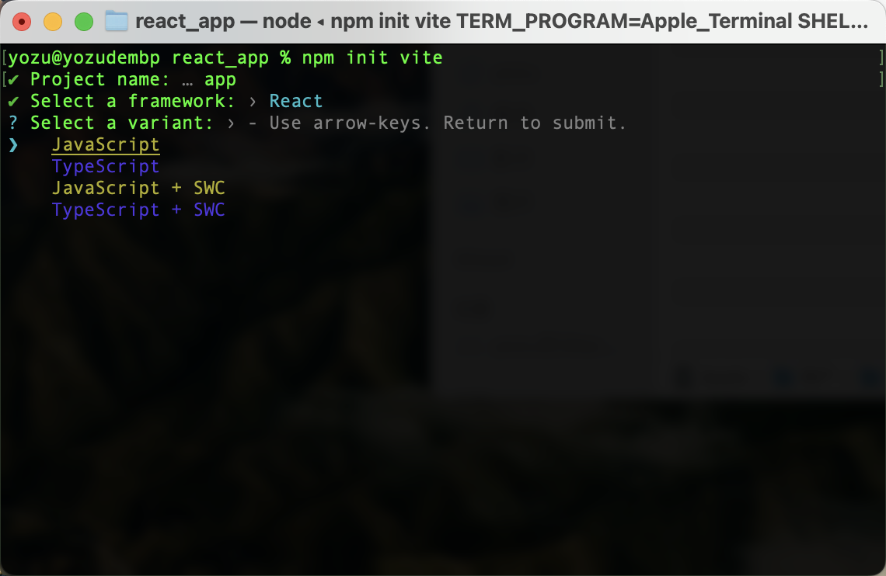
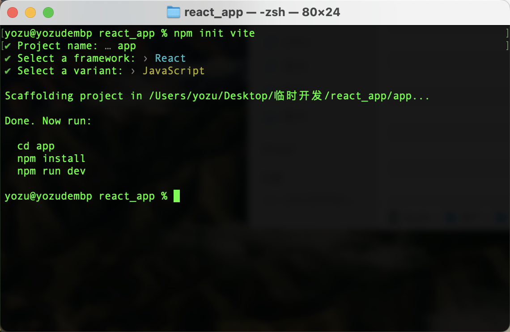

# 入门

## 目录

- [1.1React三个核心库](#11React三个核心库)
  - [react 核心库](#react-核心库)
  - [react-dom库(操作DOM)](#react-dom库操作DOM)
  - [babel库(将jsx语法转换成js)](#babel库将jsx语法转换成js)
- [1.2 虚拟DOM创建的两种方式](#12-虚拟DOM创建的两种方式)
  - [第一种：jsx创建虚拟DOM](#第一种jsx创建虚拟DOM)
  - [第二种：js语法创建虚拟DOM](#第二种js语法创建虚拟DOM)
- [1.3 React编译流程](#13-React编译流程)
- [1.4 脚手架环境安装](#14-脚手架环境安装)
  - [1.4.1普通安装（比较慢）](#141普通安装比较慢)
  - [1.4.2 vite安装](#142-vite安装)

## 1.1React三个核心库

### react 核心库

```javascript
<script src="https://unpkg.Com/react@17/udd/react.Development.js"></script>
```

### react-dom库(操作DOM)

```javascript
<script src="https: //unpkg.com/react-dom@17/umd/react-dom.development.js"></script>
```

### babel库(将jsx语法转换成js)

```javascript
<script> src="https://unpkg.com/@babel/standalone/babel.min.js"></script›
```

## 1.2 虚拟DOM创建的两种方式

#### 第一种：jsx创建虚拟DOM

```react
//1.创建虚拟DOM
const VDOM = (
    <h1 id = "title">
        <span>Hello,React</span>
    </h1>
)
```

### 第二种：js语法创建虚拟DOM

```react
//1.创建虚拟DOM
const VDOM = React.createElment('h1',{id:'title'},React.createElement('span',{},'Hello,React')))
```

## 1.3 React编译流程



## 1.4 脚手架环境安装

### 1.4.1普通安装（比较慢）

```javascript
npx create-react-app project

 //npx 运行   命令   项目名称
```

注意：通过这一个指令来创建React项目是基于webpack的，是用npx来调用create-react-app这个命令。

```javascript
cd my-app //进入文件夹

npm run start / npm strat //启动项目
```

### 1.4.2 vite安装

```javascript
npm init vite
```









```javascript
cd app //进入app目录
npm install //安装依赖
npm run dev //启动项目
```
