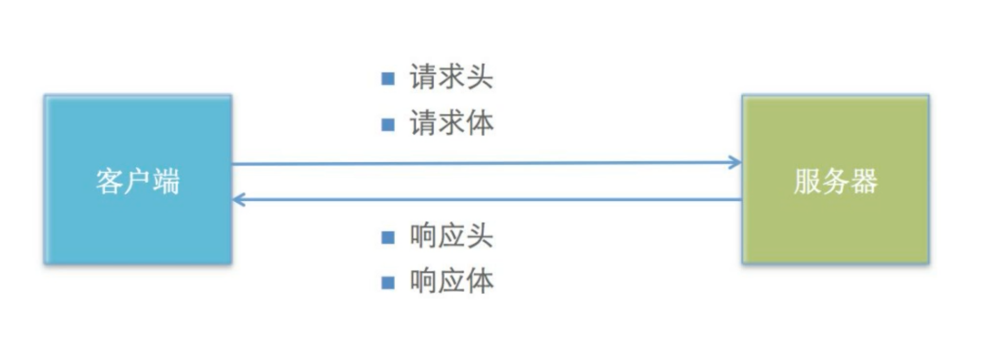

# 网络请求

## 目录

- [网络请求方式](#网络请求方式)



### 网络请求方式

fetch请求：

介绍

1.是es6中提供的一种新的网络请求方式。Fetch APl提供了一个JavaScript接口，用于访问和操纵HTTP管道的部分，不是ajax了。

1. fetch方法是一个全局方法，可以在任意位置使用
2. fetch()返回的 Promise，使用.then()获取请求成功的结果，使用.catch捕获错误信息

4.默认情况下，fetch 不会从服务端发送或接收任何 cookies，要发送 cookies，必须设置 credentials 选项，credentials的默认值是 same-origin

语法：

```react&#x20;jsx
fetch（url,{
  body:JSON.stringify(data),
  cache:'no-cache',
  credentials:'same-origin',
  headers:{
  'user-agent':'Mozilla/4.0 MDN Example',
  'content-type':'application/json'
  },
  method:'POST',
  mode:'cors',
  redirect:'follow',
  referrer:'no-referrer',
}）
```

参数说明：

1.url，网络请求地址

2.参数2是一个大的配置项

body：要网后台发生的数据，数据格式是 `key=value&key=value*`

cache：是否缓存

credentials： 是否发生和接收cookie

headers：请求头，如果是post请求，需要配置：

```react&#x20;tsx
{'content-type':'application/x-www-form-urlencoded'}
```

method：请求方式

mode：是否允许跨域

返回值

fetch()返回的 Promise对象，使用.then(获取请求成功的结果，这个结果是一个Response 对象，使用前需要解析，解析方法有：

blob()：解析成二进制

json()：解析成SON对象

text()：解析成文本
